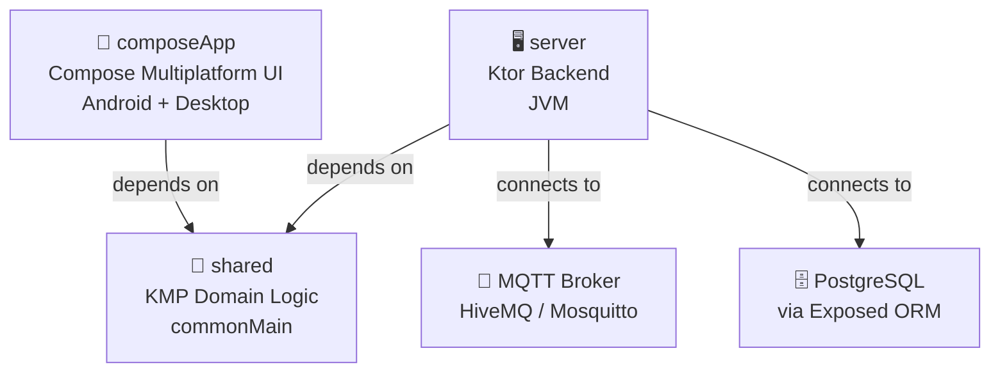

# SDD-001: Software Design Description — System Architecture

| Field | Value |
|-------|-------|
| **Document ID** | SDD-001 |
| **Version** | 1.0.0 |
| **Status** | APPROVED |
| **Author** | kmp-architect |
| **Created** | 2026-04-07 |
| **Last Updated** | 2026-04-07 |
| **Standard Reference** | IEC 62304 §5.4, FDA 21 CFR 820.30(d) |
| **Implements** | SRS-001 (all system-level REQs) |

---

## 1. Purpose & Scope

Tài liệu này mô tả **kiến trúc tổng thể** của hệ thống KMP IoT. Mỗi feature sẽ có `SDD-NNN_<feature>.md` bổ sung chi tiết design.

---

## 2. System Architecture

### 2.1 High-Level Architecture

```
┌─────────────────────────────────────────────────────────┐
│                    Client Side                          │
│  ┌──────────────┐   ┌──────────────────────────────┐   │
│  │   Android    │   │          Desktop             │   │
│  │  (API 24+)  │   │         (JVM/Compose)        │   │
│  └──────┬───────┘   └──────────────┬───────────────┘   │
│         │    Compose Multiplatform  │                   │
│         └──────────────────────────┘                   │
└───────────────────────┬─────────────────────────────────┘
                        │ WebSocket (ws://)
                        │ REST (http://)
┌───────────────────────▼─────────────────────────────────┐
│                   Backend (JVM)                         │
│         Ktor Server (Netty) — port 8085                 │
│  ┌────────────┐  ┌───────────┐  ┌───────────────────┐  │
│  │  REST API  │  │ WebSocket │  │   MQTT Bridge     │  │
│  │  Routes    │  │ Endpoints │  │  (HiveMQ Client)  │  │
│  └─────┬──────┘  └─────┬─────┘  └────────┬──────────┘  │
│        │               │                  │             │
│  ┌─────▼───────────────▼──────────────────▼──────────┐  │
│  │              Business Services                     │  │
│  │  DeviceService, SensorService, AuthService        │  │
│  └─────────────────────┬───────────────────────────┘  │
│                        │                               │
│  ┌─────────────────────▼───────────────────────────┐  │
│  │         Data Layer (Exposed ORM + HikariCP)     │  │
│  │  DeviceDao, SensorDao  →  PostgreSQL            │  │
│  └─────────────────────────────────────────────────┘  │
└─────────────────────────────────┬───────────────────────┘
                                  │ MQTT (tcp://:1883)
┌─────────────────────────────────▼───────────────────────┐
│              IoT Hardware Layer                         │
│  ESP8266 / ESP32 Devices   ←→   MQTT Broker (HiveMQ)   │
│  RS485 / Modbus Sensors                                 │
└─────────────────────────────────────────────────────────┘
```

### 2.2 Module Dependency Graph



### 2.3 Layer Definitions (REQ-A002)

| Layer | Package | Responsibility | Dependencies |
|-------|---------|---------------|-------------|
| Domain | `shared/commonMain/…/models/` | Pure data classes, interfaces | None |
| Repository | `shared/commonMain/…/repository/` | Data access contracts | Domain only |
| Service | `server/…/service/` | Business logic | Repository, Domain |
| Infrastructure | `server/…/database/`, `server/…/mqtt/` | External systems | Service |
| Presentation | `composeApp/…/ui/` | UI screens, ViewModels | Repository (via Koin) |

### 2.4 Dependency Injection (REQ-A003)

Koin modules:
```kotlin
// shared: sharedModule, networkModule
// server: serverModule, databaseModule, mqttModule
// composeApp: appModule, viewModelModule
```

---

## 3. Client Design (composeApp)

### 3.1 Navigation (REQ-U001)

**Framework**: Voyager Navigator  
**Pattern**: Screen objects pushed onto navigator stack

```
TabNavigator
  ├── DashboardScreen (Tab 1)
  ├── DeviceListScreen (Tab 2)
  └── SettingsScreen (Tab 3)

DashboardScreen → DeviceDetailScreen (push)
DeviceListScreen → DeviceDetailScreen (push)
```

### 3.2 State Management (REQ-U002, REQ-U004)

**Pattern**: Unidirectional Data Flow

```
ViewModel.state: StateFlow<ScreenState>
    ↓ collectAsStateWithLifecycle()
Composable reads state (never writes directly)
    ↓ UI events
ViewModel.onEvent(event) → update state
```

**ScreenState** always includes:
```kotlin
data class XxxState(
    val isLoading: Boolean = false,
    val error: String? = null,        // REQ-U002
    val isOffline: Boolean = false,   // REQ-U003
    // feature-specific fields...
)
```

---

## 4. IoT Communication Design

### 4.1 MQTT Topic Convention (REQ-N002)

```
devices/{deviceId}/data      QoS 1 — Sensor data (device → server)
devices/{deviceId}/status    QoS 1 — Heartbeat (device → server)
devices/{deviceId}/command   QoS 1 — Control commands (server → device)
devices/{deviceId}/response  QoS 1 — Command ACK (device → server)
devices/register             QoS 1 — Device registration on boot
```

### 4.2 MQTT Data Flow & Validation (REQ-N001, REQ-S005)

```
Device publishes → Ktor MqttMessageHandler
    → MqttTopicRouter.route(topic, payload)
    → SensorPayload.deserialize() — invalid JSON → drop + log
    → SensorPayload.isValid() — out of range → drop + log
    → SensorService.save(deviceId, payload)
    → RealtimeDeviceHub.emit(deviceId, payload)
    → WebSocket clients receive update
```

Valid ranges:
| Sensor | Min | Max |
|--------|-----|-----|
| Temperature | -40°C | 125°C |
| Humidity | 0% | 100% |
| Voltage | 0V | 500V |
| Current | 0A | 100A |

### 4.3 WebSocket Real-time Bridge (REQ-N004)

```kotlin
// server/mqtt/RealtimeDeviceHub — SharedFlow per device
// server/routes/WebSocketRoutes — collect and forward to WS clients
```

---

## 5. Backend Design (Ktor Server)

### 5.1 Server Configuration (REQ-B003)

```kotlin
// Application.kt entry point
embeddedServer(Netty, port = 8085) {
    configureSerialization()   // kotlinx.serialization JSON
    configureCORS()
    configureAuthentication()  // JWT (REQ-B002)
    configureWebSockets()
    configureDatabases()       // Exposed + HikariCP (REQ-B004)
    configureRouting()
    startMqttService()
}
```

Health endpoint: `GET /health` → `{ "status": "ok", "db": "ok", "mqtt": "ok" }` (REQ-B003)

### 5.2 Database Schema

```sql
-- Devices table
CREATE TABLE devices (
    id VARCHAR(36) PRIMARY KEY,
    name VARCHAR(100) NOT NULL,
    type VARCHAR(50) NOT NULL,     -- ESP8266, ESP32, RS485, MQTT_SENSOR
    status VARCHAR(20) NOT NULL,   -- ONLINE, OFFLINE, ERROR
    ip_address VARCHAR(45),
    port INTEGER DEFAULT 80,
    firmware VARCHAR(50),
    created_at BIGINT NOT NULL,
    last_seen BIGINT DEFAULT 0
);

-- Sensor readings
CREATE TABLE sensor_readings (
    id SERIAL PRIMARY KEY,
    device_id VARCHAR(36) NOT NULL REFERENCES devices(id),
    timestamp BIGINT NOT NULL,
    temperature DOUBLE PRECISION,
    humidity DOUBLE PRECISION,
    voltage DOUBLE PRECISION,
    current DOUBLE PRECISION,
    raw JSONB
);
```

### 5.3 JWT Configuration (REQ-B002, REQ-SC001, REQ-SC002)

```kotlin
// Loaded from env vars — never hardcoded
val jwtSecret  = System.getenv("JWT_SECRET") ?: error("JWT_SECRET not set")
val jwtIssuer  = System.getenv("JWT_ISSUER") ?: "iot-server"
val jwtExpiry  = 3_600_000L   // 1 hour (REQ-SC001)

// jwt-admin: role == ADMIN (write operations)
// jwt-user:  any authenticated user (read operations)
```

### 5.4 Input Validation (REQ-B005, REQ-B006)

All request DTOs implement `fun validate(): ValidationResult`.  
On invalid: `400 Bad Request` with `{"error": "message", "code": "VALIDATION_ERROR"}`.

---

## 6. Shared Module Design

### 6.1 Package Structure

```
shared/src/commonMain/kotlin/caonguyen/vu/
├── models/           # Domain models (zero dependencies)
├── repository/       # Repository interfaces + Fake impls
├── network/          # MQTT client interface
├── di/               # Koin shared module
└── platform/         # expect/actual declarations
```

### 6.2 Repository Pattern (REQ-A002)

```kotlin
// Interface in commonMain — no platform imports
interface DeviceRepository {
    fun observeDevices(): Flow<List<Device>>
    suspend fun getDevice(id: String): Device?
}

// Fake implementation for tests + Desktop preview
class FakeDeviceRepository : DeviceRepository { ... }
```

---

## 7. Deployment Architecture (REQ-SC004)

```
Internet
    │ HTTPS
    ▼
Nginx (reverse proxy + TLS termination)
    │ HTTP
    ▼
Ktor Server (port 8085)
    │
    ├── PostgreSQL (port 5432, internal only)
    └── MQTT Broker (port 8883 TLS, 1883 internal)
```

Docker Compose services: `ktor-server`, `postgres`, `mosquitto`

---

*Document: SDD-001 | Standard: IEC 62304 §5.4 | Implements: SRS-001*
