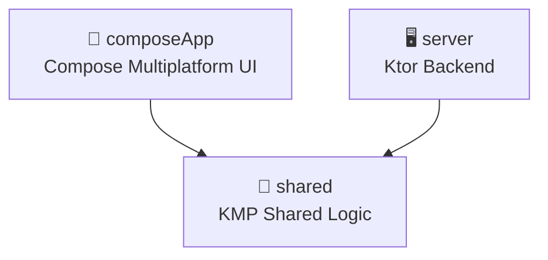

# KMP Module Dependency Analysis

**Generated**: 2026-04-07T21:28:51.011113

## Modules Found (3)

- **composeApp**: 18 Kotlin files, 0 cross-module imports
- **shared**: 25 Kotlin files, 0 cross-module imports
- **server**: 18 Kotlin files, 0 cross-module imports

## Module Dependency Diagram

## Circular Dependencies

✅ No circular dependencies detected