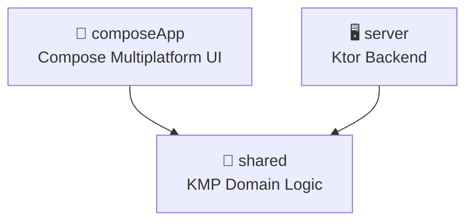

# Architecture Overview

> **Updated**: 2026-04-07 13:04 UTC

## Module Structure

```
KMPRoadMap/
├── shared/          # KMP shared business logic (commonMain)
│   ├── models/      # Domain data classes
│   ├── repository/  # Repository interfaces + Fake implementations
│   ├── network/     # MQTT client interface
│   └── di/          # Koin shared module
├── composeApp/      # Compose Multiplatform UI
│   └── ui/          # Screens + ViewModels (Voyager)
├── server/          # Ktor backend (JVM)
│   ├── database/    # Exposed ORM tables + DAOs
│   ├── routes/      # Ktor REST route handlers
│   ├── service/     # Business services
│   └── mqtt/        # HiveMQ/MQTT gateway
└── iosApp/          # iOS wrapper
```

## Tech Stack

| Layer | Technology | Version |
|-------|-----------|--------|
| Language | Kotlin Multiplatform | 2.3.0 |
| UI | Compose Multiplatform | 1.10.0 |
| Navigation | Voyager | 1.1.0-beta03 |
| Backend | Ktor (Netty) | 3.3.3 |
| Database | Exposed + PostgreSQL | 0.49.0 |
| DI | Koin | 3.6.0 |
| MQTT Client | HiveMQ | 1.3.3 |
| RS485 | jSerialComm | 2.10.4 |
| Testing | kotlin-test + coroutines-test | 2.3.0 |
| Auth | Ktor JWT | 3.3.3 |

## Module Dependencies



## Architecture Principles

1. **KMP-first**: Tối đa code trong `commonMain`, tối thiểu platform-specific
2. **Repository pattern**: Interface ở `shared/`, Fake impl cho tests và Desktop preview
3. **Unidirectional Data Flow**: ViewModel → StateFlow → Compose UI
4. **IoT Data Flow**: `ESP8266 → MQTT(HiveMQ) → Ktor → WebSocket → Compose`
5. **Coroutine Safety**: Không dùng GlobalScope, tất cả qua structured concurrency

