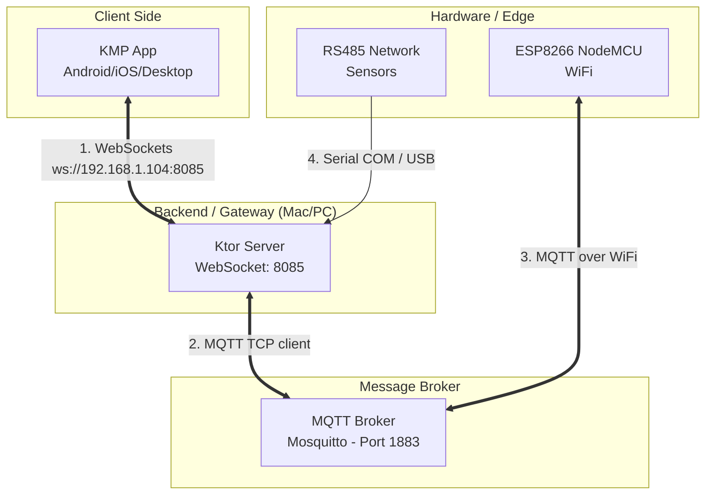
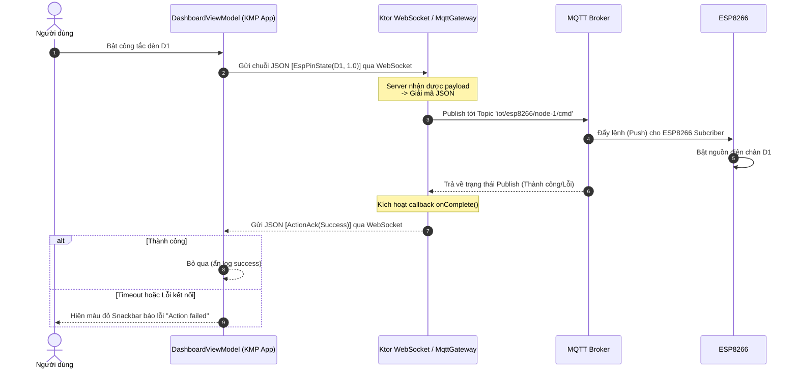
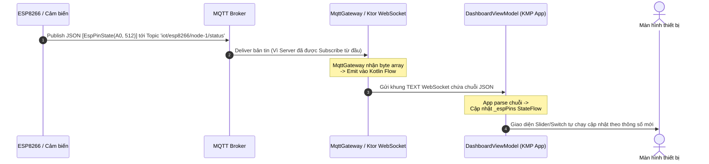

# Kiến trúc Hệ sinh thái IoT & Data Flow

Tài liệu này mô tả chi tiết cách thức các thành phần trong hệ thống IoT giao tiếp với nhau, bao gồm Ứng dụng Compose Multiplatform (KMP App), Khối Server xử lý trung tâm (Ktor Server), Trạm trung chuyển bản tin (MQTT Broker) và Các thiết bị phần cứng (ESP8266, RS485).

---

## 1. Sơ đồ Kiến trúc Tổng thể (Architecture)

Biểu đồ dưới đây thể hiện các thành phần vật lý và logic tham gia vào hệ thống, cùng với những giao thức kết nối chúng.

**Vai trò của từng thành phần:**
*   **KMP App:** Giao diện người dùng. Hiển thị thông số mượt mà và nhận lệnh (bật tắt đèn, kéo slider) từ người dùng.
*   **Ktor Server:** Hoạt động như một "Gateway" cầu nối. 
    * Chuyển đổi tín hiệu **WebSocket** (từ App) thành tín hiệu **MQTT** (để gửi cho phần cứng).
    * Lắng nghe tín hiệu từ phần cứng (MQTT, Serial RS485) và đẩy ngược về App qua WebSocket.
*   **MQTT Broker:** Trạm bưu điện trung tâm, định tuyến các bản tin giữa Server Gateway và các board mạch ESP8266.
*   **Hardware (ESP8266):** Trực tiếp điều khiển điện áp ngõ ra (Digital D1, D2; Analog A0) và đọc dữ liệu cảm biến.

---

## 2. Luồng dữ liệu: Gửi lệnh điều khiển (App -> Hardware)

Khi anh bật một công tắc (`Switch`) trên App hoặc kéo thanh trượt (`Slider`), quá trình sau sẽ diễn ra:

---

## 3. Luồng dữ liệu: Phần cứng báo cáo trạng thái (Hardware -> App)

Khi ESP8266 đọc được thông số mới từ cảm biến, hoặc nút nhấn vật lý trên tường làm thay đổi trạng thái đèn, nó sẽ báo cáo ngược lại cho App hiển thị theo thời gian thực (Real-time update) mà không cần User phải làm mới trang.

### Các biến môi trường đang dùng (từ BuildKonfig)
Trong thiết kế này, các chuỗi nhạy cảm và khác nhau trên nhiều nền tảng đã được gom lại quản lý 1 nơi ở Gradle.
*   `BuildKonfig.WEBSOCKET_HOST` (IP Mac `192.168.1.104`): Để KMP App biết đường dẫn kết nối vào Ktor Server.
*   `BuildKonfig.MQTT_BROKER_HOST` (Localhost `127.0.0.1`): Giúp Ktor Server tìm thấy Mosquitto MQTT Broker đang chạy trên cùng máy tính đó.
*   Topic Command (`MQTT_CMD_TOPIC`): `iot/esp8266/node-1/cmd`
*   Topic Status (`MQTT_STATUS_TOPIC_FILTER`): `iot/esp8266/+/status`
